# 학습도우미

## :pushpin: 프로젝트 소개

**`학습도우미`** 는 영어 학습 성과를 확인 하고 싶은 **`선생님`** 과 **`학생`** 을 위한 **`학습 도움 웹사이트`** 입니다. <br />

학습도우미를 통해 **학생의 과제 수행 여부를 쉽게 확인** 할 수 있습니다.

## :busts_in_silhouette: 팀 소개

- **이건호** (팀장) <br/>
  **`역할`** : 백엔드/프론트엔드/PM
  **`이메일`** : dinggul56@gmail.com
  <br/>

- **송원석** <br/>
  **`역할`** : 백엔드/프론트엔드
  **`이메일`** : songwon199943@gmail.com
  <br/>

- **유희웅** <br/>
  **`역할`** : 백엔드/프론트엔드
  **`이메일`** : heewoong7843@gmail.com
  <br/>

- **이상엽** <br/>
  **`역할`** : 백엔드/프론트엔드
  **`이메일`** : porcelainheart945@gmail.com

## :calendar: 개발 기간

```
2023.11.07 ~ 2023.12.12 (약 21일)
```

# :sparkles: 핵심 기능

:one: **`선생님`** 이 학생들에게 **과제를 내주는** 기능

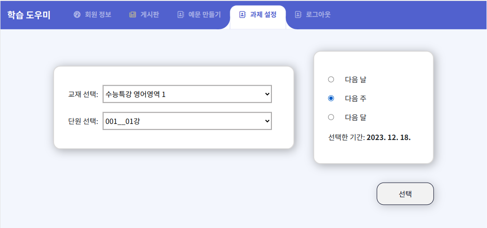

:two: **`선생님`** 이 학생 **과제 수행 여부 파악**하는 기능

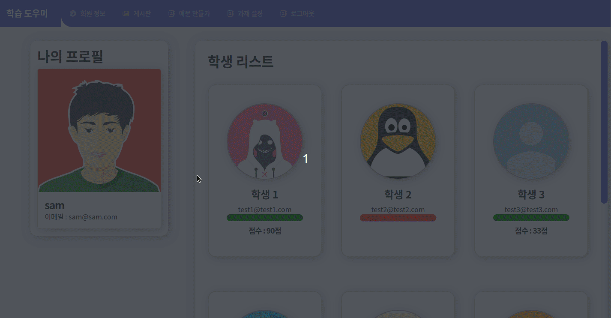

- 학생이 과제를 수행했다면 **`초록색`**, 수행하지 않았다면 **`빨간색`** 으로 표현됩니다.
- 수행한 학생의 **`점수`** 를 확인할 수 있습니다.
- 모달(modal)을 이용해 학생의 **`틀린 문제`** 가 무엇인지 볼 수 있습니다.

:three: **`학생`** 이 **과제 수행** 하는 기능

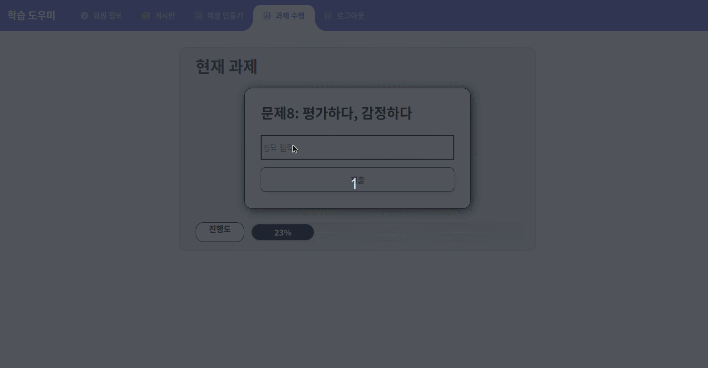

:four: **틀린 단어 목록 보기** 기능

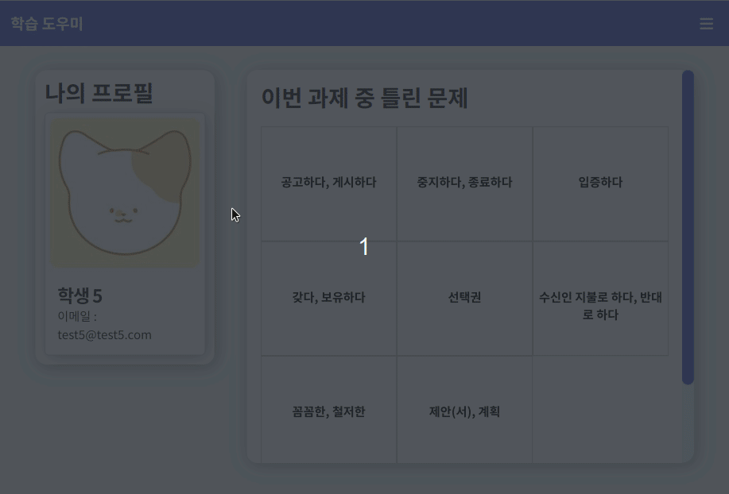

## :star: 부가 기능

1. 게시판 + 댓글
   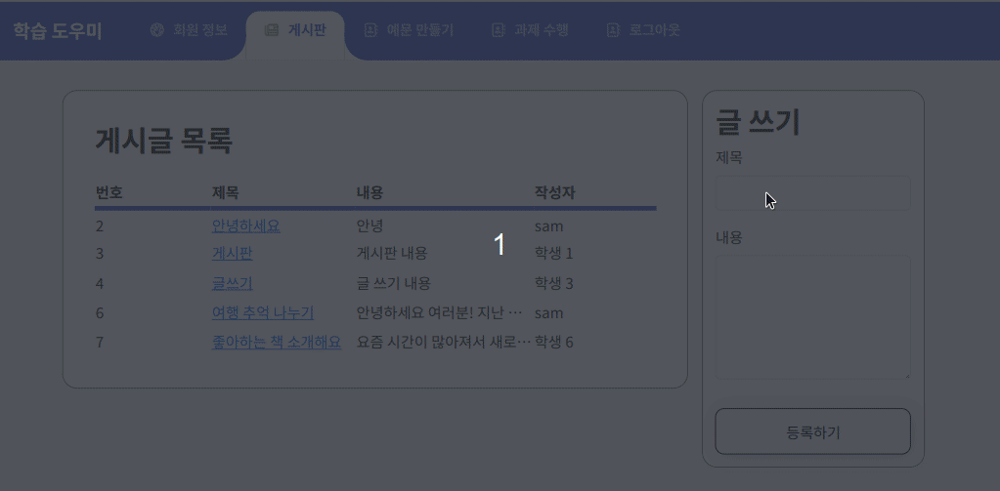
   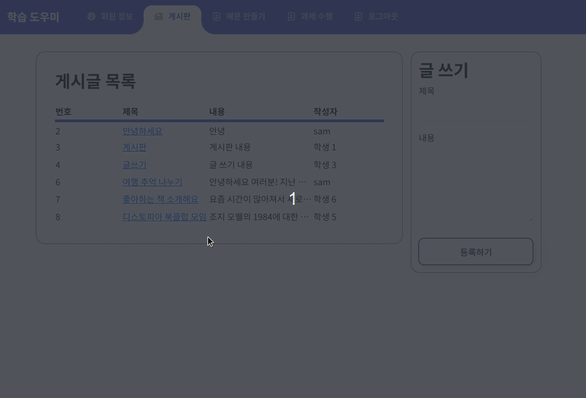

2. 예문 만들기 + 단어 추가
   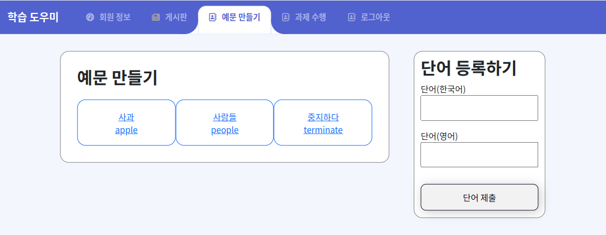
   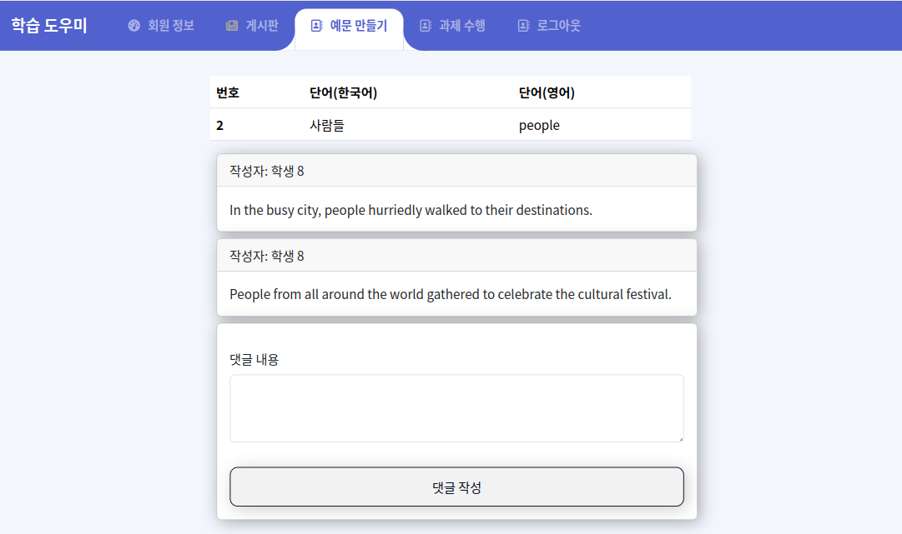

3. 회원정보 수정
   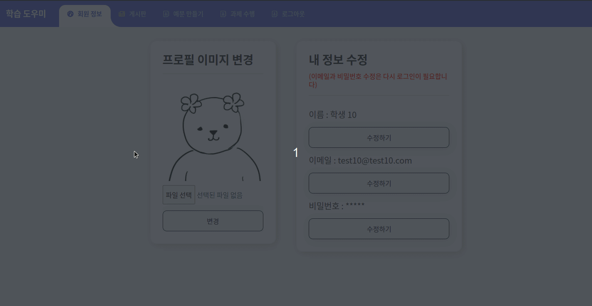

4. 로그인/ 회원가입
   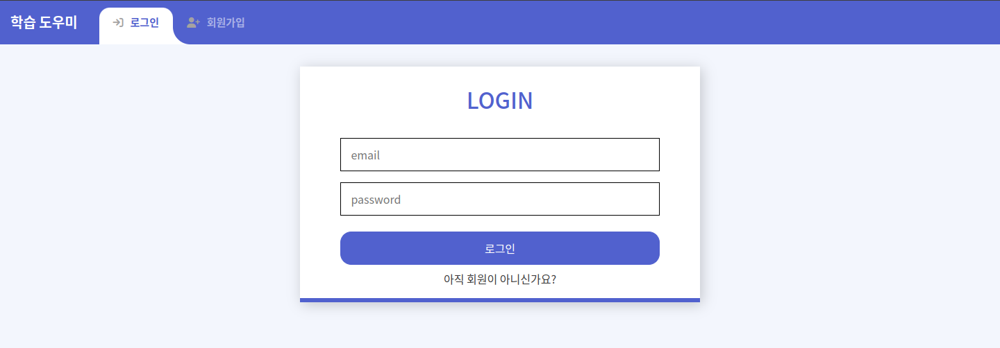
   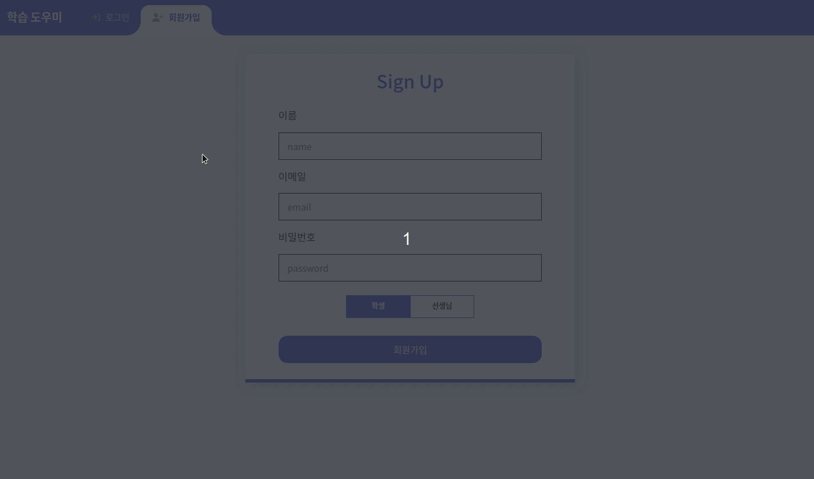

5. 반응형 웹사이트

   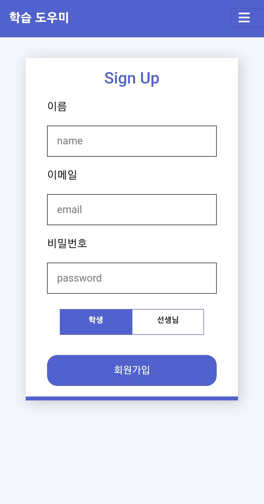 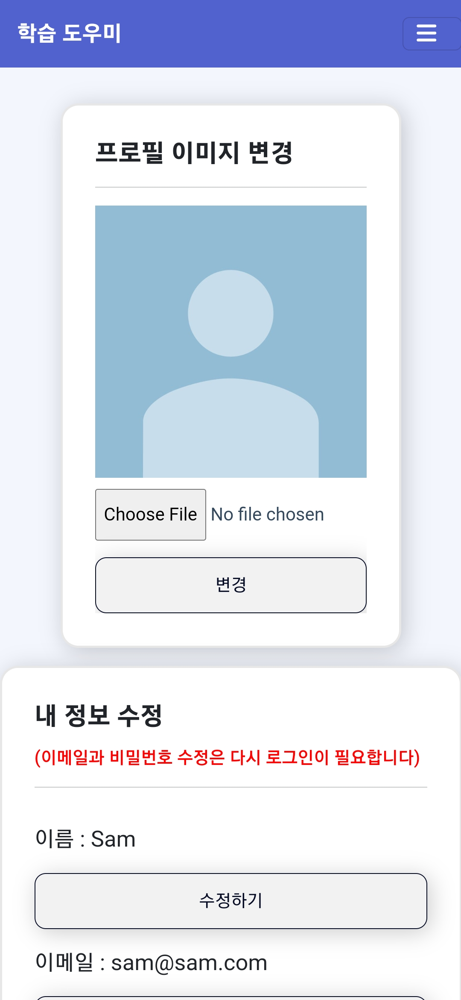 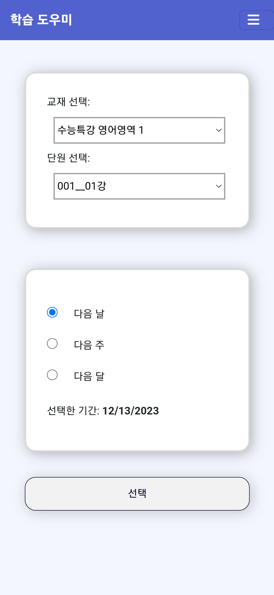

# :pencil2: 기획

## :page_facing_up: ERD

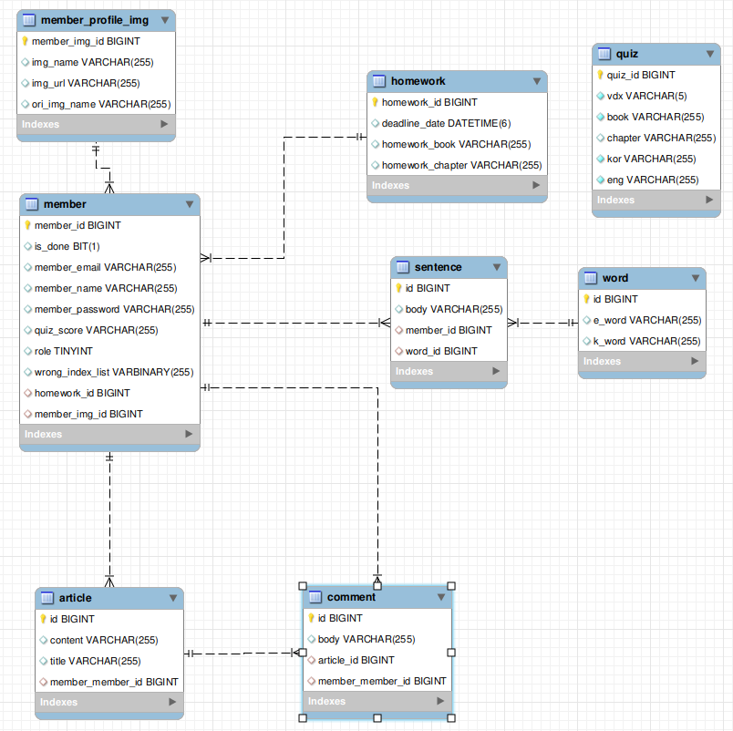

## :sparkler: Oven

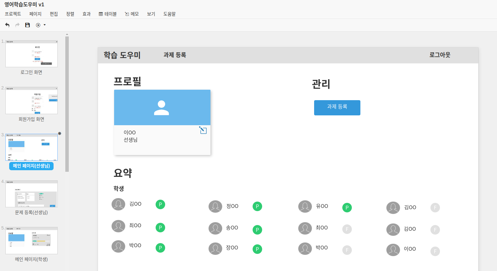

## 🔧 기술 스택 & 개발 환경

                   

## 리액트 라이브러리

- axios
- react-router-dom
- react-cookie
- react-modal
- react-fontawesome
