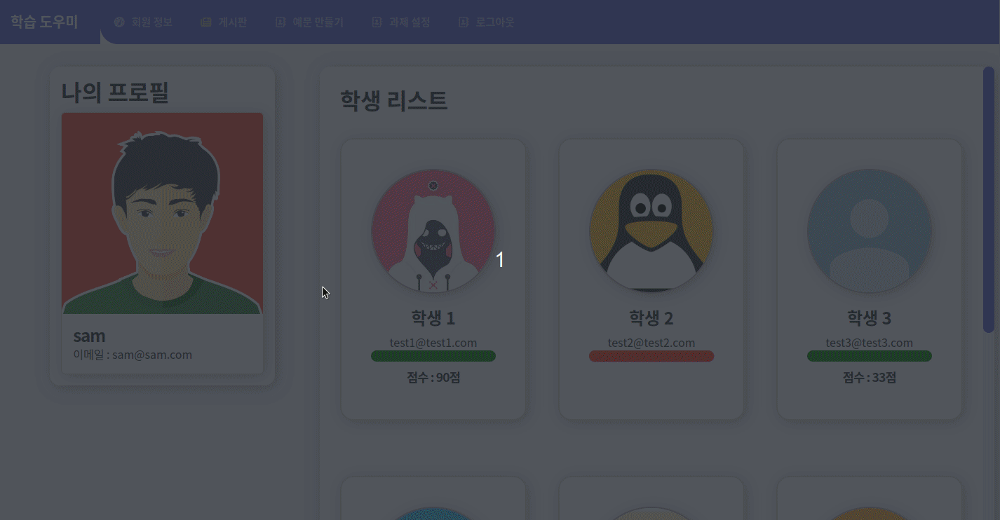
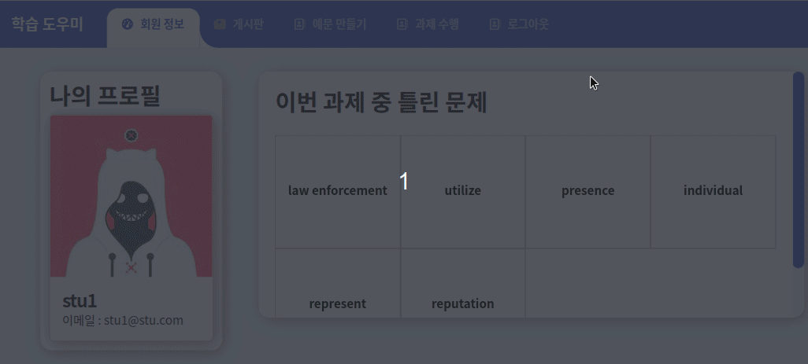
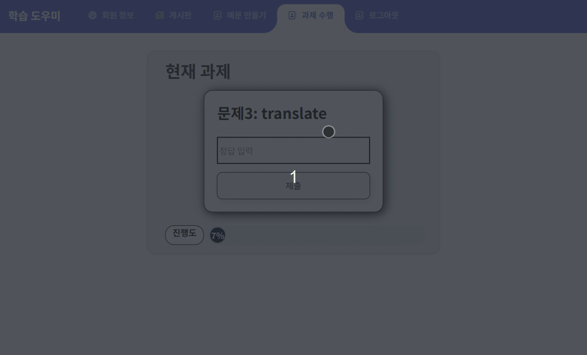

# 학습도우미

## :pushpin: 프로젝트 소개

**`학습도우미`** 는 영어 학습 성과를 확인 하고 싶은 **`선생님`** 과 **`학생`** 을 위한 **`학습 도움 웹사이트`** 입니다. 학습도우미를 통해 **학생의 과제 수행여부를 쉽게 확인** 할 수 있습니다.

## :busts_in_silhouette: 팀 소개

- **이건호** (팀장) <br/>
  **`역할`** : 백엔드/프론트엔드/PM
  **`이메일`** : dinggul56@gmail.com
  <br/>

- **송원석** <br/>
  **`역할`** : 백엔드/프론트엔드
  **`이메일`** : songwon199943@gmail.com
  <br/>

- **유희웅** <br/>
  **`역할`** : 백엔드/프론트엔드
  **`이메일`** : heewoong7843@gmail.com
  <br/>

- **이상엽** <br/>
  **`역할`** : 백엔드/프론트엔드
  **`이메일`** : porcelainheart945@gmail.com

## :calendar: 개발 기간

```
2023.11.07 ~ 2023.12.12 (약 21일)
```

## :sparkles: 핵심 기능

선생님이 학생 과제 수행 여부 파악하는 것



틀린 단어 보여지는 것



과제 수행 하는 것



과제 내주는 것
